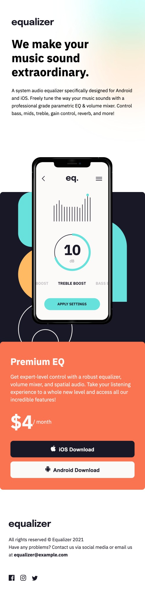
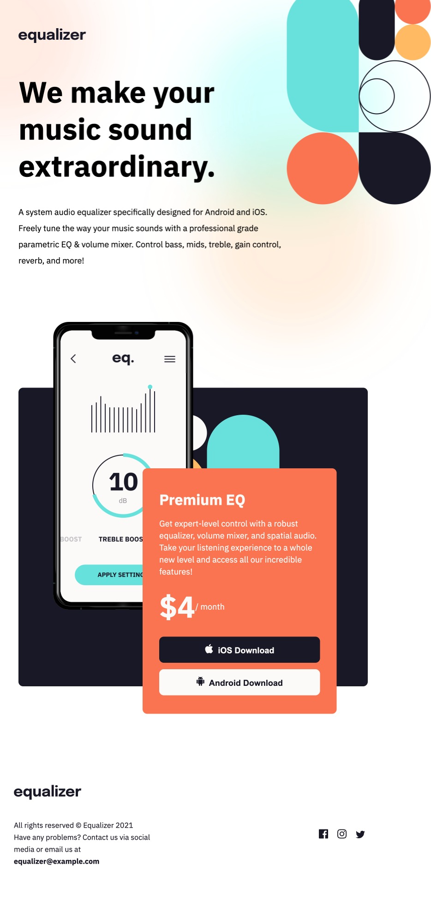

# Equalizer landing page solution

## Table of contents

- [Equalizer landing page solution](#equalizer-landing-page-solution)
  - [Table of contents](#table-of-contents)
  - [Overview](#overview)
    - [The challenge](#the-challenge)
    - [Screenshot](#screenshot)
      - [Mobile design](#mobile-design)
      - [Tablet design](#tablet-design)
      - [Desktop design](#desktop-design)
  - [My process](#my-process)
    - [Built with](#built-with)
    - [What I learned](#what-i-learned)
    - [Continued development](#continued-development)
  - [Author](#author)

## Overview

### The challenge

Users should be able to:

- View the optimal layout depending on their device's screen size
- See hover states for interactive elements

### Screenshot

#### Mobile design


#### Tablet design


#### Desktop design


## My process

### Built with

- Semantic HTML5 markup
- CSS custom properties
- Flexbox
- CSS Grid
- Mobile-first workflow
- [React](https://reactjs.org/) - JS library
- [Styled Components](https://styled-components.com/) - For styles


### What I learned

I have furthered my development in layout designs and the use of CSS Grid and flexbox to achieve this.

I also gained confidence  in applying psuedo selectors like 


```css
& :first-child {
    width: 75%;
  }
```

### Continued development

Further my design layout and responsive design skills with more complicated designs.


## Author

- LinkedIn - [Sally Wright](https://www.linkedin.com/in/sally-wright-411b541a0/)
